# Gestor de Pedidos
Este projeto é uma plataforma web para gestão de projetos, clientes e atividades dentro de um ambiente de desenvolvimento de software
# Funcionalidades
Gestão de Clientes: Adicione, edite e exclua clientes.
Gestão de Projetos: Crie e gerencie projetos, associe-os a clientes e acompanhe seus status.
Acompanhamento de Atividades: Associe atividades a projetos e clientes, gerencie seus cronogramas e acompanhe o progresso.
Interface Responsiva: O front-end é desenvolvido em Angular, oferecendo uma interface de usuário limpa e responsiva.
API RESTful: O back-end é desenvolvido em Java e Spring Boot, expondo uma API RESTful para interação com o front-end.
Integração com Banco de Dados: Armazenamento persistente usando PostgreSQL com Hibernate ORM.
Deploy: Hospedado no Heroku com deploy contínuo a partir do GitHub.

# Tecnologias Utilizadas
* Frontend: Angular, TypeScript, Bootstrap
* Backend: Java, Spring Boot, Hibernate, PostgreSQL
* Testes: JUnit, Mockito

#  Pré-requisitos
* Java 11 ou superior
* Node.js 14 ou superior
* PostgreSQL 13 ou superior
* Maven 3.6+
* Angular CLI 12+
* Git

# Endpoints da API
### Clientes
GET /api/clients - Obter a lista de todos os clientes.
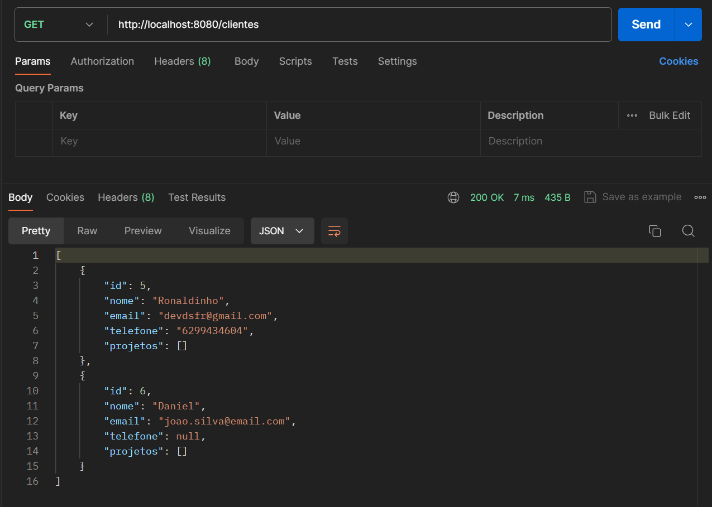
POST /api/clients - Criar um novo cliente.
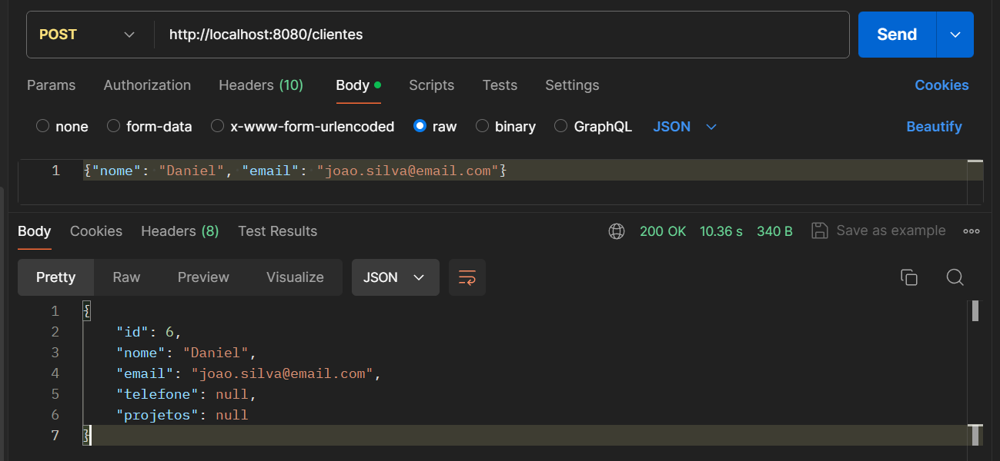
GET /api/clients/{id} - Obter um cliente específico por ID.
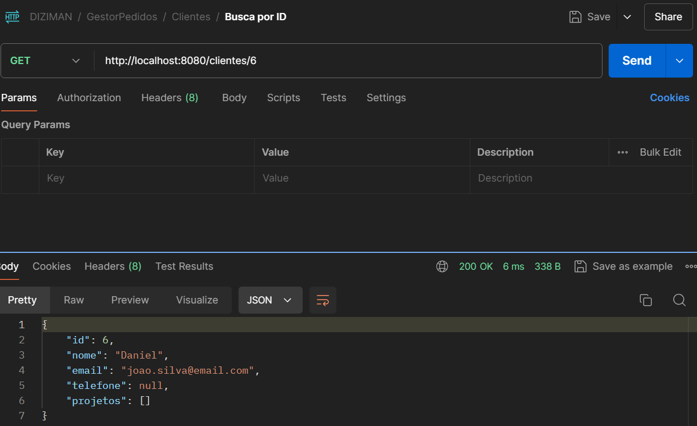
PUT /api/clients/{id} - Atualizar um cliente por ID.
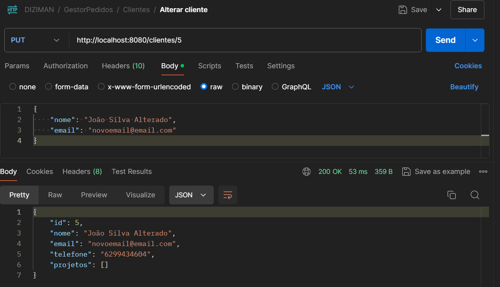
DELETE /api/clients/{id} - Excluir um cliente por ID.
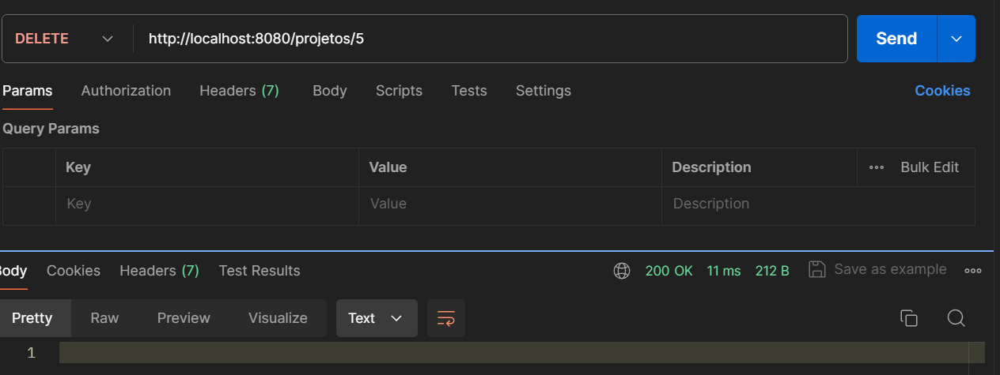
### Projetos
GET /api/projects - Obter a lista de todos os projetos.
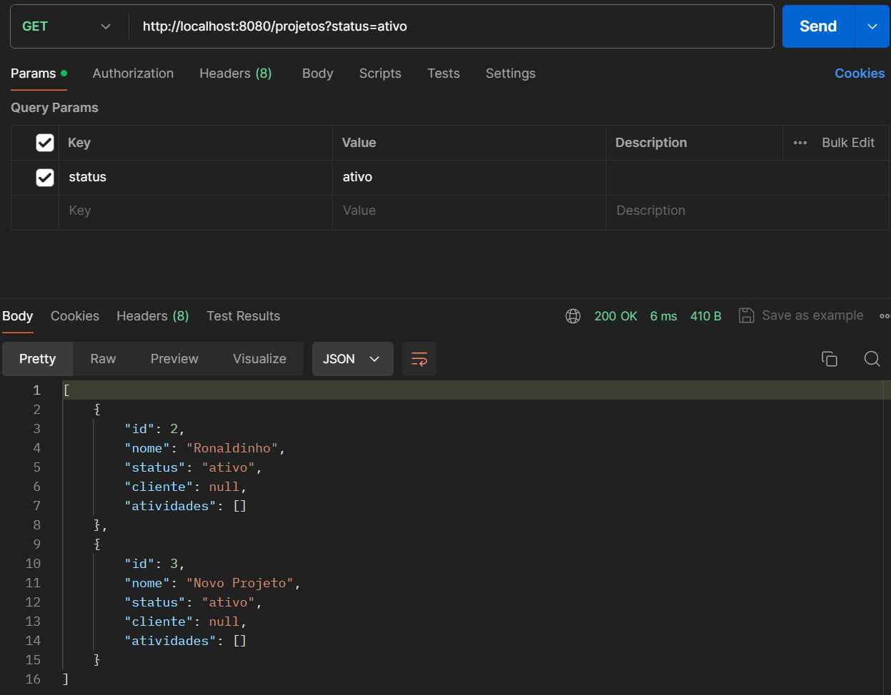
POST /api/projects - Criar um novo projeto.
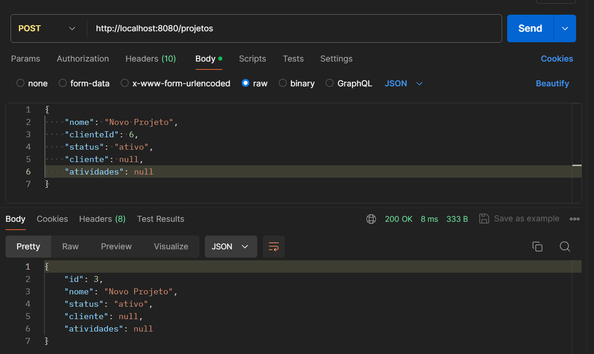
GET /api/projects/{id} - Obter um projeto específico por ID.
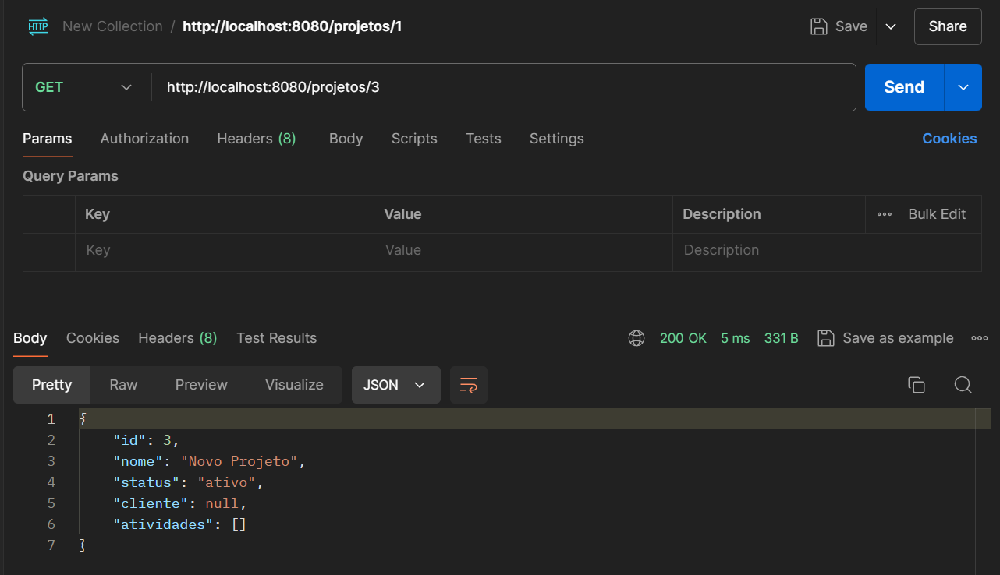
PUT /api/projects/{id} - Atualizar um projeto por ID.
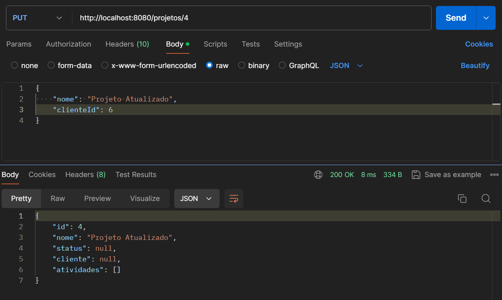
DELETE /api/projects/{id} - Excluir um projeto por ID.
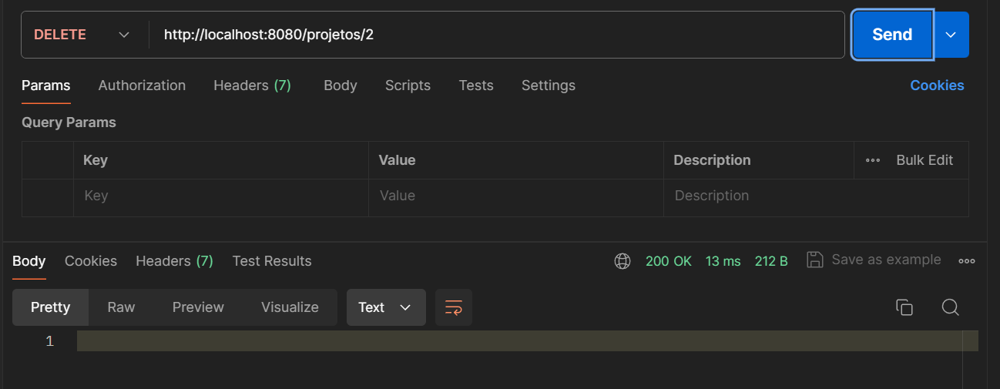
### Atividades
GET /api/activities - Obter a lista de todas as atividades.
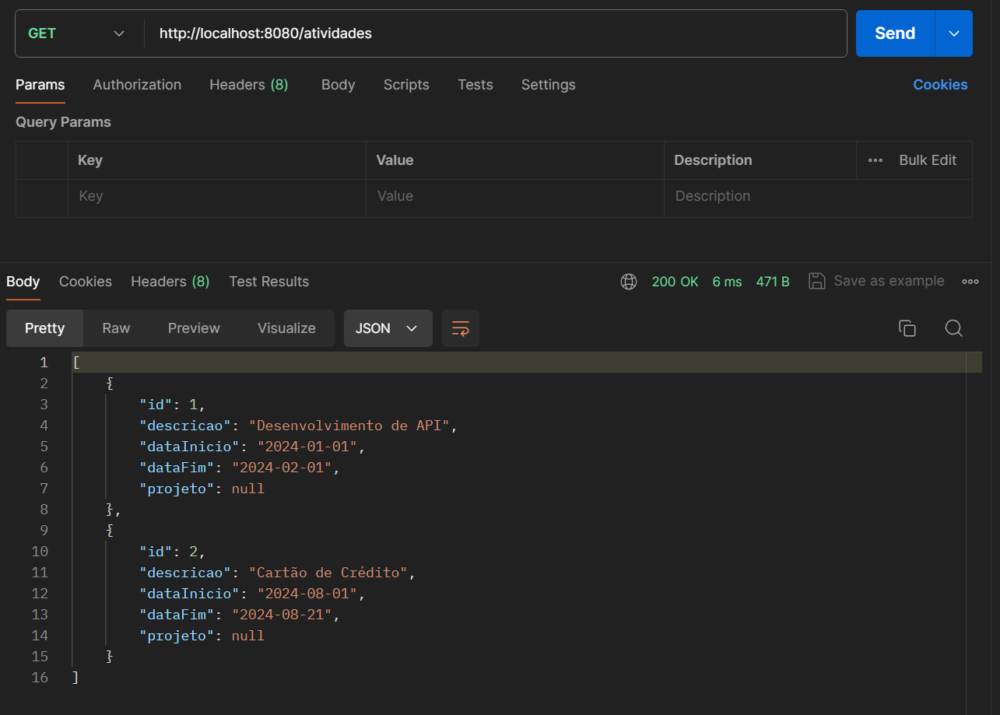
POST /api/activities - Criar uma nova atividade.
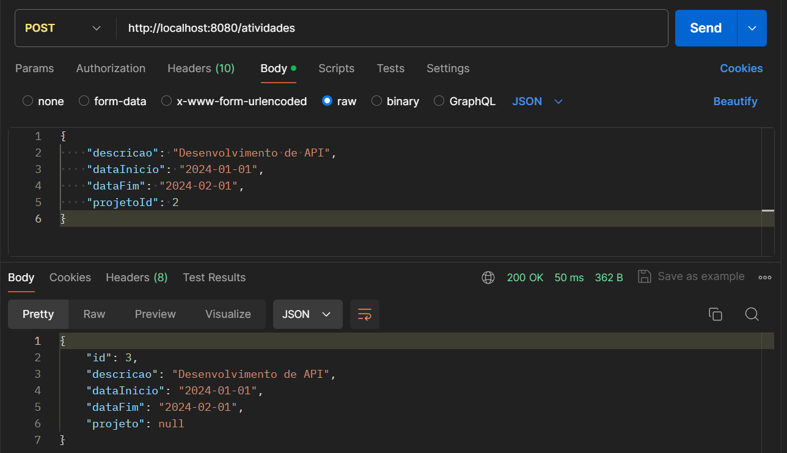
GET /api/activities/{id} - Obter uma atividade específica por ID.
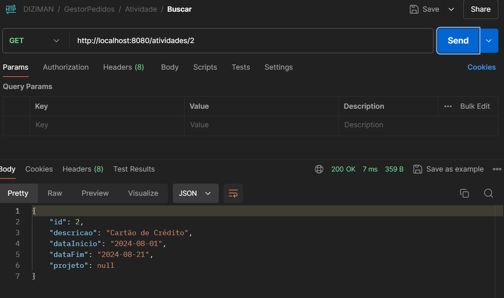
PUT /api/activities/{id} - Atualizar uma atividade por ID.
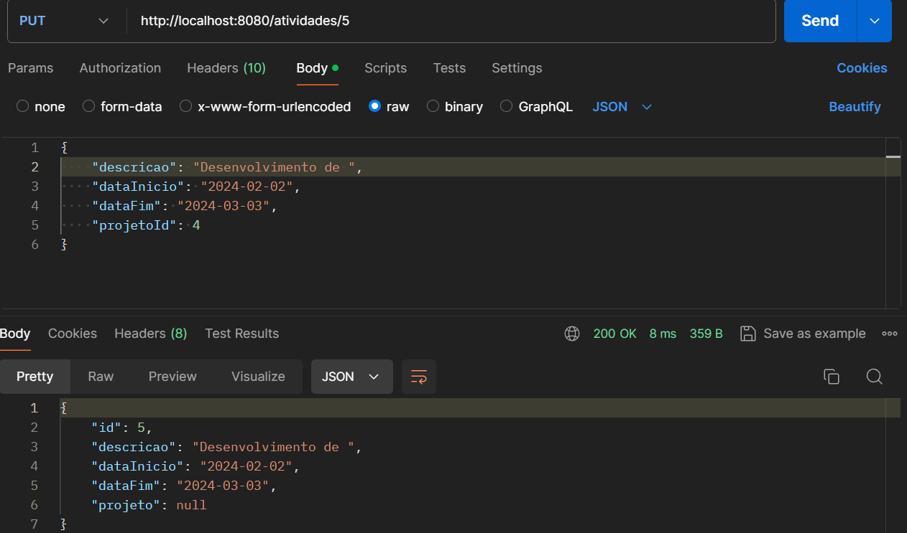
DELETE /api/activities/{id} - Excluir uma atividade por ID.
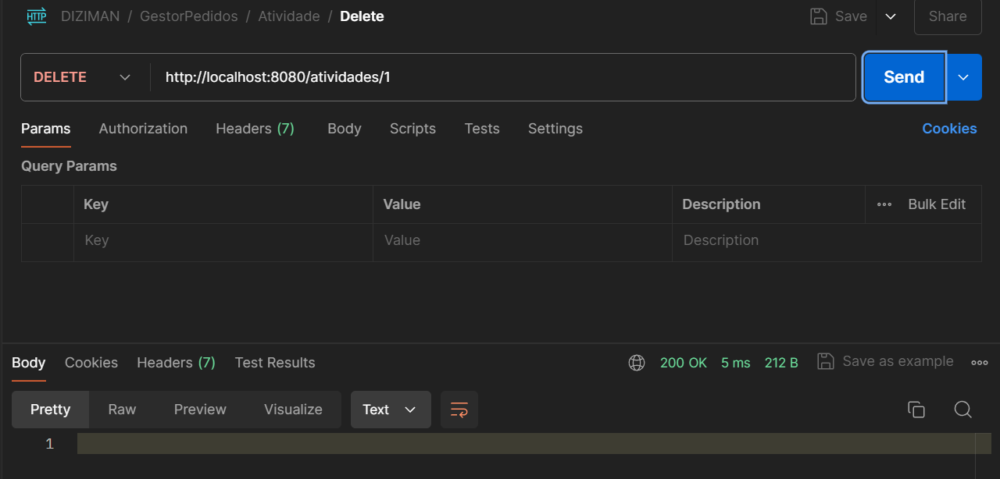
 Link do Postman dos endpoints https://documenter.getpostman.com/view/11387908/2sAXjF9v78